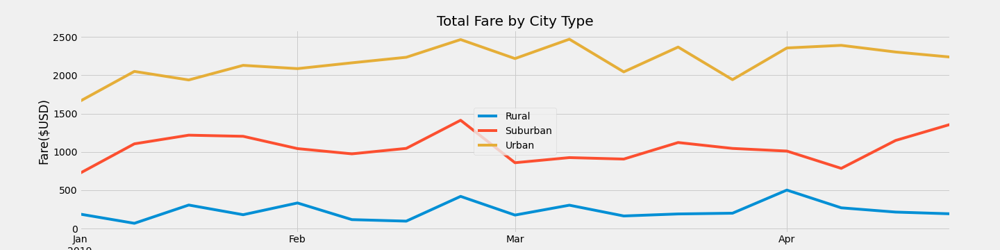

# PyBer_Analysis
## Overview of the Analysis
In this project using the Python skills and knowledge of pandas, data frame is created for ride-sharing data by city type and a multiple-line graph that shows weekly fares for each city type is created using Pandas and Matplotlib.

## Results
*	Average number of rides in the rural cities is about 3.5 and 2.5 times lower than urban and suburban cities, respectively.
* The average number of rides in the rural cities is about 4- and 3.5-times lower per city than the urban and suburban cities, respectively.
* The average fare for rides in the rural cities is about $11 and $5 more per ride than the urban and suburban cities, respectively.
*	The average number of drivers in rural cities is nine to four times less per city than in urban and suburban cities, respectively.

## Summary
Urban cities have far more total rides as well as drivers compared to suburban and rural cities. It is more expensive for a rider in the rural areas than urban and suburban areas. Drivers in rural areas earn more per ride may be due to less drivers in rural city.

